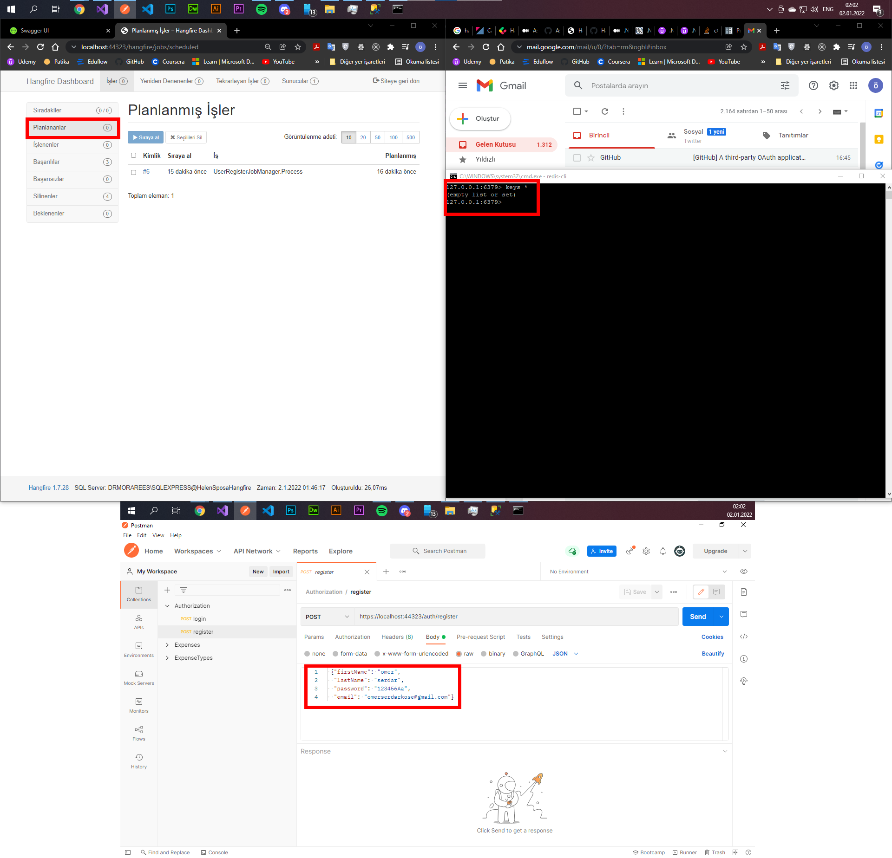
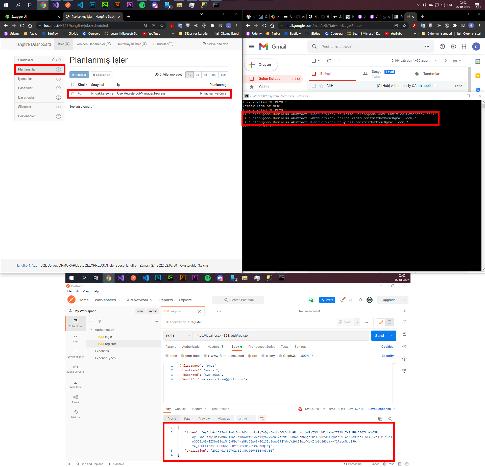
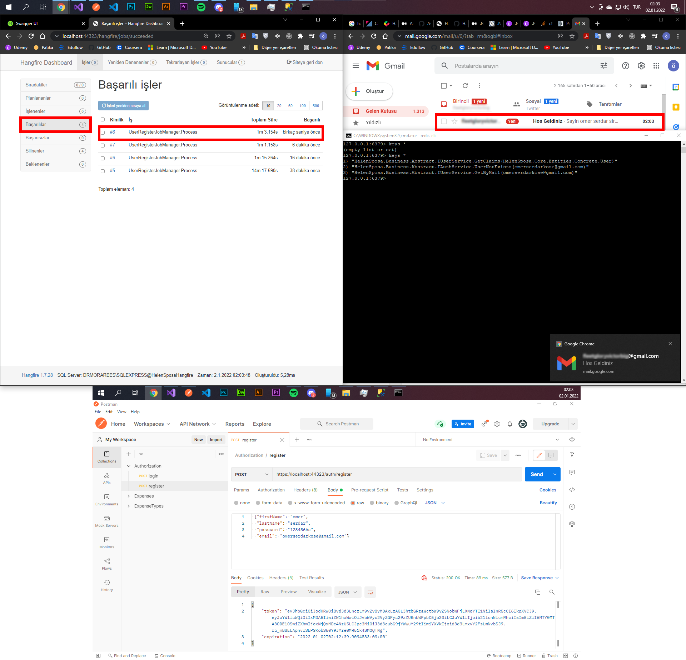

5.Odev kapsaminda;

-Halihazirda mevcut olan In Memory Cache ozelligine ilave olarak **Redis** ile Distributed Cache ozelligi eklendi. Dependency tanimlamalarinda tek kelimelik isim degisikligi ile tum yapinin caching ozelligi degisebilir duruda.(SOLID yapi)(HelenSposa.Core>DependecyResolver>CoreModule)

-BackgroundJobs icin **Hangfire** kutuphanesi kullanildi. Smtp konfigurasyonu dahil edildi. Sisteme register olan kisiye 1 dk sonrasinda "Hos Geldiniz" maili atan yapi aktive edildi. (HelenSposa.WepApi>app.json icerisinden smtp config de gecerli mail bilgileri gerekli)

-Business katmaninda bazi methodlar icin yetki aspecti kullanildi. Yetkisiz girisler engellendi. Register ve Login silemlerinde **JWT** kullanildi
(Ornek=>HelenSposa.Business>Concrete>Managers>ExpenseManager>GetAll() )

-Not: Proje bir magazanin musterileri bilgilerini, randevularini, gelir ve giderlerini takip edebilecegi bir uygulama olarak gelistirilmeye baslandi. DB temel anlamda hazir olmasina ragmen(Scripti yukarida) tum entitylere ait islemler ve business kodlari henuz hazir degil. Temel yapinin hazirliklari devam ediyor. Bu sebeple Dosyalamalar bir miktar karisik gelebilir 

#### Redis ve Hangfire Baslangic Durumu

#### Register sonrasi Token, Redis ve Hangfire

#### Hangfire Processing sonrasi

## Patika-Gelecek Varlik Full Stack Bootcamp Projesi
	Bootcamp suresince alinan egitimlerin uygulanmasi kapsaminda gelistirilen proje.

### Amac

- Backend kisminda '.Net Core', Frontend kisminda 'React' kullanilarak kurumsal mimari ve best-practise orneklerini iceren islevsel bir proje olusturmak

### Gelistirme Sureci
- Bootcamp suresinde ogrenilen her yeni yontem ve teknoloji sonrasinda ilaveler ve refactoring islemleri ile surekli olarak gelisim

### Kazanimlar
- **Hangfire** kutuphanesine ait kullanim ornekleri
- DistributedCaching with **Redis**
- **Interceptor** kullanimi
- **Cross Cutting Concern** ve **Aspect Oriented Programming**
- **JWT** kutuphanesine ait kullanim ornekleri
- **FluentValidation** kutuphanesine ait kullanim ornekleri
- **AutoMapper** kutuphanesine ait kullanim ornekleri
- **Dependency Injection** ve IoC Container(**Autofac**) kullanimi
- **Reflection** kullanimi
- **Attribute** kullanimi
- **Extension** kullanimi
- **View Model** ve **Dto** kavramlari
- **EntityFramework Core** proje dahil edilmesi ve kullanimi
- **Interface** kullaniminin onemi
- **Deger ve Referans tipler** arasindaki farklar
- **Katmanli mimari** ve uygulama ornekleri
- **SOLID** prensibleri
- **Iliskisel veri tabani** tasarimi ve **SQL** kullanimi
- **Git** ve **GitHub** kullanimi konusunda tecrubeler

 